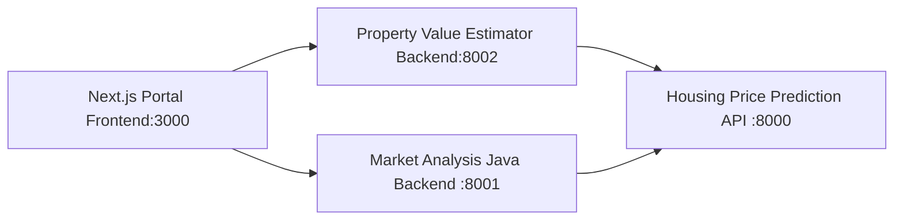
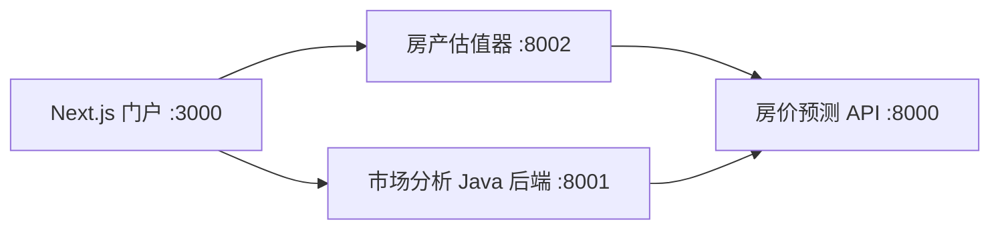

# HSBC 房产解决方案项目集

[中文](#中文文档) | **English**

---

## English

A full-stack property solutions platform consisting of 4 interconnected services: a machine learning prediction model, two backend APIs, and a Next.js frontend portal.

### Architecture Overview



### Sub-Projects

| Project | Tech Stack | Port | Description |
|---------|-----------|------|-------------|
| [housing-price-prediction-model-api](./housing-price-prediction-model-api) | CatBoost + FastAPI | 8000 | ML model serving — single & batch house price predictions |
| [property-market-analysis-java-backend](./property-market-analysis-java-backend) | Java 21 + Spring Boot 3.4 | 8001 | Market statistics, data table queries, prediction proxy with caching |
| [property-value-estimator-python-backend](./property-value-estimator-python-backend) | Python 3.13 + FastAPI | 8002 | Property value estimation proxy with input validation |
| [mulit-application-nextjs-portal](./mulit-application-nextjs-portal) | Next.js 16 + React 19 + TypeScript | 3000 | Frontend portal — estimator, market analysis dashboard, history |

### Quick Start

**1. Start the Housing Price Prediction Model API**

> **Prerequisites:**
> - Python 3.13+ (for local run)
> - Docker (for containerized run)
> - The trained model artifacts in `model/` directory (generated by `train_catboost.py`)

**Option A — Local Run:**

```bash
cd housing-price-prediction-model-api

# 1. Create and activate virtual environment
python -m venv .venv
.venv\Scripts\activate        # Windows
# source .venv/bin/activate   # Linux/Mac

# 2. Install dependencies
pip install -r requirements.txt

# 3. Train the CatBoost model (generates model/ artifacts)
#    Skip this step if model/ already contains catboost_model.cbm
python train_catboost.py

# 4. Start the API server on port 8000
uvicorn main:app --reload --host 127.0.0.1 --port 8000
```

**Option B — Docker Run:**

```bash
cd housing-price-prediction-model-api

# Build the Docker image (includes model training during build)
docker build -t housing-price-api .

# Run the container
docker run -d --name housing-price-api -p 8000:8000 housing-price-api
```

**Verify & Explore:**

| URL | Description |
|-----|-------------|
| [http://localhost:8000/docs](http://localhost:8000/docs) | Swagger interactive API documentation |
| [http://localhost:8000/redoc](http://localhost:8000/redoc) | ReDoc API documentation |
| `GET /` | Health check |
| `POST /predict` | Single house price prediction |
| `POST /predict/batch` | Batch predictions (min 3 houses) |
| `GET /model-info` | Model metadata, evaluation metrics & feature importance |

**2. Start the Java Market Analysis Backend**

```bash
cd property-market-analysis-java-backend
./mvnw.cmd spring-boot:run
```

**3. Start the Python Value Estimator Backend**

```bash
cd property-value-estimator-python-backend
python -m venv .venv && .venv\Scripts\activate
pip install -r requirements.txt
python -m app.main
```

**4. Start the Next.js Frontend Portal**

```bash
cd mulit-application-nextjs-portal
npm install
npm run dev
```

Open [http://localhost:3000](http://localhost:3000) in your browser.

### Key Features

- **Property Value Estimator** — Input 7 property features, get instant ML-powered price predictions with chart visualizations
- **Estimation History** — View, compare, and analyze past predictions with radar chart overlays
- **Market Analysis Dashboard** — Aggregate statistics, sortable/filterable data tables, what-if analysis, and ranking charts
- **ML Model API** — CatBoost model with R² = 0.9925, feature engineering (7 original + 11 derived features)
- **Caching** — Caffeine-based 10-minute TTL cache on prediction endpoints
- **Accessibility** — WCAG 2.1 compliant with skip links, ARIA labels, and keyboard navigation

---

## 中文文档

全栈房产解决方案平台，由 4 个互联服务组成：机器学习预测模型、两个后端 API 和一个 Next.js 前端门户。

### 架构概览



### 子项目

| 项目 | 技术栈 | 端口 | 说明 |
|------|--------|------|------|
| [housing-price-prediction-model-api](./housing-price-prediction-model-api) | CatBoost + FastAPI | 8000 | ML 模型服务 — 单套及批量房价预测 |
| [property-market-analysis-java-backend](./property-market-analysis-java-backend) | Java 21 + Spring Boot 3.4 | 8001 | 市场统计分析、数据表查询、带缓存的预测代理 |
| [property-value-estimator-python-backend](./property-value-estimator-python-backend) | Python 3.13 + FastAPI | 8002 | 房产价值估算代理，含输入校验 |
| [mulit-application-nextjs-portal](./mulit-application-nextjs-portal) | Next.js 16 + React 19 + TypeScript | 3000 | 前端门户 — 估值工具、市场分析看板、历史记录 |

### 快速开始

**1. 启动房价预测模型 API**

> **前置条件：**
> - Python 3.13+（本地运行）
> - Docker（容器化运行）
> - `model/` 目录下需有训练好的模型文件（由 `train_catboost.py` 生成）

**方式一 — 本地运行：**

```bash
cd housing-price-prediction-model-api

# 1. 创建并激活虚拟环境
python -m venv .venv
.venv\Scripts\activate        # Windows
# source .venv/bin/activate   # Linux/Mac

# 2. 安装依赖
pip install -r requirements.txt

# 3. 训练 CatBoost 模型（生成 model/ 目录下的模型文件）
#    如果 model/ 下已有 catboost_model.cbm 可跳过此步
python train_catboost.py

# 4. 启动 API 服务，端口 8000
uvicorn main:app --reload --host 127.0.0.1 --port 8000
```

**方式二 — Docker 运行：**

```bash
cd housing-price-prediction-model-api

# 构建 Docker 镜像（构建过程中包含模型训练）
docker build -t housing-price-api .

# 运行容器
docker run -d --name housing-price-api -p 8000:8000 housing-price-api
```

**验证与探索：**

| 地址 | 说明 |
|------|------|
| [http://localhost:8000/docs](http://localhost:8000/docs) | Swagger 交互式 API 文档 |
| [http://localhost:8000/redoc](http://localhost:8000/redoc) | ReDoc API 文档 |
| `GET /` | 健康检查 |
| `POST /predict` | 单套房价预测 |
| `POST /predict/batch` | 批量预测（最少 3 套） |
| `GET /model-info` | 模型元信息、评估指标及特征重要性 |

**2. 启动 Java 市场分析后端**

```bash
cd property-market-analysis-java-backend
./mvnw.cmd spring-boot:run
```

**3. 启动 Python 估值后端**

```bash
cd property-value-estimator-python-backend
python -m venv .venv && .venv\Scripts\activate
pip install -r requirements.txt
python -m app.main
```

**4. 启动 Next.js 前端门户**

```bash
cd mulit-application-nextjs-portal
npm install
npm run dev
```

在浏览器中打开 [http://localhost:3000](http://localhost:3000)。

### 核心功能

- **房产估值工具** — 输入 7 个房产特征，即时获取 ML 驱动的价格预测及图表可视化
- **历史记录** — 查看、对比和分析历史预测结果，支持雷达图叠加对比
- **市场分析看板** — 聚合统计、可排序/筛选的数据表格、What-If 分析和排行图表
- **ML 模型 API** — CatBoost 模型 R² = 0.9925，特征工程（7 个原始特征 + 11 个衍生特征）
- **缓存机制** — 基于 Caffeine 的 10 分钟 TTL 缓存，加速预测接口响应
- **无障碍支持** — 符合 WCAG 2.1 标准，支持跳过导航、ARIA 标签和键盘操作
